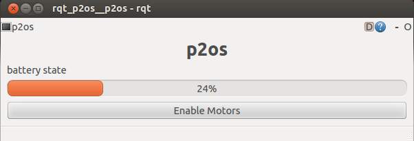

# rqt_p2os

## A GUI for the p2os pioneer rover controller

A very simple update of the old p2os controller for [catkin](http://wiki.ros.org/catkin) and [rqt](http://wiki.ros.org/rqt).
This allows rqt_p2os to run ony ROS build post Groovy.



Fully featured with:

- With a motor controller button
- A slightly improved battery indicator


### Build

Add in any sourced catkin src directory, and then:

```
catkin_make
```

### Run

To run either run in a terminal:

```
rosrun rqt_p2os rqt_p2os
```

or,

```
rqt
```

remembering to run for first time only

```
rqt --force-discover
```

 
